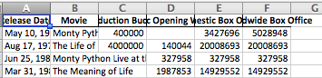
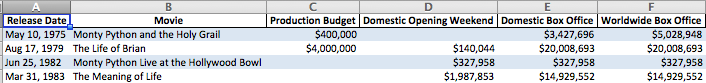

[Pandas](http://pandas.pydata.org/) with [xlwings](http://xlwings.org/). More formatting options when using `to_excel()`

## Dependencies 

* Install packages `pandas`, `xlwings` using:

		$ pip install <package_name>
				
## Installation

* Clone the repository

		$ git clone https://github.com/robertdavidwest/flyingpandas.git

* `cd` into `flyingpandas`
* Install the package
  
        $ python setup.py install

## Examples

### - flyingpandas.merge()

* If you've used Stata in the past and are now using Pandas, chances are you probably misse some of the functionality and frankly some of the safety nets. `flyingpandas.merge()` is a more conservative version of `pandas.merge()` which includes more explcit merge specifications (such as pre conditions expressing the uniqueness of the key variables in each dataframe). i.e. if you expect the merge to be one to one, then the mandatory first parameter, `mergetype` should be set to `'1:1'` For example:

		frame_1 = pd.DataFrame({'A': [1, 2, 3, 4, 5, 6, 7],
		                        'B': [10, 20, 30, 40, 50, 60, 70],
		                        'C': ['This', 'program', 'will',
		                              'work', 'some', 'day', '!']})
		
		frame_2 = pd.DataFrame({'A': [1, 2, 3, 4, 5, 6, 8],
		                        'B': [10, 20, 30, 40, 50, 60, 80],
		                        'D': ['Everyone', 'hates', 'debugging',
		                              '!', 'It', 'is', 'terrible']})
	
	    df = merge('1:1', frame_2, frame_1, on=['A', 'B'], how='left')
	    print df
				
		----------------------------------------
		Merge Statistics (left  1:1)
		On: ['A', 'B']/['A', 'B']
		            Count
		both            6
		left_only       1
		right_only      0
		
		Rows of   left dataframe: 7
		Rows of  right dataframe: 7
		Rows of merged dataframe: 7
		
		merge time: (seconds)
		0.064
		----------------------------------------

For full functionality, see the doc string.

### - flyingpandas.ExcelWriter().to_excel()

`flyingpandas.to_excel` is just like `pandas.DataFrame.to_excel`. Except that you can make things really pretty really quickly.

For example. I made this with `pandas.to_excel`:

like this:

    import pandas
    data = ...
    writer = pandas.ExcelWriter('pd_example.xlsx')
	data.to_excel(writer, index=False)
	writer.close()
	
and I made this with `flyingpandas.to_excel`:

like this:

	import pandas
	import flyingpandas
	data = ...
	writer = flyingpandas.ExcelWriter('fp_example.xlsx')
	
	column_formats = {'Production Budget': '$#,##0',
	                  'Domestic Opening Weekend': '$#,##0',
	                  'Domestic Box Office' : '$#,##0',
	                  'Worldwide Box Office': '$#,##0'}
	writer.to_excel(data, index=False, column_formats=column_formats,
	                add_color_rows=True, autofit=True)
	writer.close()
	

### Here's the details

* `flyingpandas` uses to `xlwings` to add formatting to your excel files after you've used `pandas.to_excel`
* It has all the same functionality as `pandas.to_excel` i.e. multiple dataframes per sheet and multiple sheets per workbook with the convenience of adding simple but sometimes necessary formatting
* For example you can make a quick report whereby you need multiple dataframe per sheet, each representing a category with something like this:

		import pandas
		import flyingpandas
	
		writer = flyingpandas.ExcelWriter('example.xlsx')

		# heading and subheading
		heading = 'This is my heading'
		date_range_desc = 'from {} to {}'.format(q_begin, q_end)
		subheading = bpid + ', ' + date_range_desc
		titles = pd.DataFrame({'titles': [heading, subheading]})
		writer.to_excel(titles, index=False, header=False,
		                add_color_rows=False, autofit=False)

		column_formats = {'some cost': '$#,##0',
		                  'another cost': '$#,##0',
		                  'and a ratio': '0%'}		
		startrow = 2
		for i, cat in enumerate(set(data.categorical)):
			subset = data.query('categorical == @cat')
			subset = subset.drop(axis=1, labels='categorical')
			
			thisrow = startrow + len(subset) + 2
			writer.to_excel(subset, index=False, column_formats=column_formats,
		                    add_color_rows=True, autofit=True,
							startrow=thisrow, startcol=3)

The `startrow` and `startcol` inputs match those used in `pandas.to_excel` (i.e. they are indexed from 0)